# SAT-Annotator - Level 0 Context Diagram

This is the highest level view of the SAT-Annotator system, showing the system as a single process with external entities.

## Context Diagram (Level 0)

```mermaid
graph TB
    %% External Entities
    User[👤 User/Annotator<br/>Researcher/GIS Specialist]
    FileSystem[📁 File System<br/>Local Storage]
    SAMModel[🤖 SAM AI Model<br/>Segment Anything]
    
    %% Main System
    System[🛰️ SAT-Annotator System<br/>Satellite Image Annotation Tool]
    
    %% Data Flows    User -->|1.1 Upload Satellite Images<br/>JPG/PNG/TIFF/GeoTIFF| System
    User -->|1.2 Point Prompts<br/>Click Coordinates| System
    User -->|1.3 Manual Annotations<br/>Polygon Drawing| System
    User -->|1.4 Export Requests<br/>JSON Format| System
    
    System -->|2.1 Processed Images<br/>Metadata & Thumbnails| User
    System -->|2.2 AI Segmentation Results<br/>Polygon Boundaries| User
    System -->|2.3 Annotation Files<br/>JSON/Shapefile| User
    System -->|2.4 Session Status<br/>Upload Progress| User
      System -->|3.1 Store Image Files<br/>Original & Processed| FileSystem
    System -->|3.2 Store Annotation Data<br/>JSON Files| FileSystem
    FileSystem -->|3.3 Retrieve Images<br/>For Processing| System
    FileSystem -->|3.4 Retrieve Annotations<br/>For Export| System
    
    System -->|4.1 Image Data<br/>Pixel Arrays| SAMModel
    System -->|4.2 Point Prompts<br/>X,Y Coordinates| SAMModel
    SAMModel -->|4.3 Segmentation Masks<br/>Binary Masks| System
    SAMModel -->|4.4 Confidence Scores<br/>Quality Metrics| System

    %% Styling
    classDef userStyle fill:#e1f5fe,stroke:#01579b,stroke-width:2px
    classDef systemStyle fill:#f3e5f5,stroke:#4a148c,stroke-width:3px
    classDef externalStyle fill:#fff3e0,stroke:#e65100,stroke-width:2px
    
    class User userStyle
    class System systemStyle
    class FileSystem,SAMModel externalStyle
```

## Data Flow Description

### External Entities:
- **User/Annotator**: Researchers, GIS specialists, or remote sensing analysts who upload and annotate satellite images
- **File System**: Local or network storage for image files and annotation data
- **SAM AI Model**: Segment Anything Model providing AI-powered segmentation capabilities

### Data Flows:
1. **Input Flows (User → System)**:
   - Upload satellite images in various formats
   - Provide point prompts for AI segmentation
   - Create manual annotations
   - Request data exports

2. **Output Flows (System → User)**:
   - Display processed images with metadata
   - Show AI-generated segmentation results
   - Provide downloadable annotation files
   - Display real-time session status

3. **Storage Flows (System ↔ File System)**:
   - Store and retrieve image files
   - Persist annotation data

4. **AI Processing Flows (System ↔ SAM Model)**:
   - Send image data and prompts to AI model
   - Receive segmentation masks and confidence scores

## Purpose
This context diagram provides a high-level overview of the SAT-Annotator system's boundaries and its interactions with external entities, showing the main data flows without internal system details.
