# SAT-Annotator - Level 1 Data Flow Diagram

This diagram breaks down the SAT-Annotator system into its major functional processes.

## Level 1 DFD

```mermaid
graph TB
    %% External Entities
    User[👤 User/Annotator]
    FileSystem[📁 File System]
    SAMModel[🤖 SAM AI Model]
      %% Processes
    P1["1.0 🔐 Session Management"]
    P2["2.0 📤 Image Upload & Processing"]
    P3["3.0 🤖 AI Segmentation"]
    P4["4.0 ✏️ Manual Annotation"]
    P5["5.0 📊 Data Export"]
    P6["6.0 🌐 Web Interface"]
    
    %% Data Stores
    DS1[("D1 Session Store")]
    DS2[("D2 Image Cache")]
    
    %% User Interactions
    User -->|Login/Session Request| P1
    User -->|Upload Images| P2
    User -->|Point Prompts| P3
    User -->|Manual Polygons| P4
    User -->|Export Request| P5
    User -->|Web Requests| P6
    
    P1 -->|Session Data| User
    P2 -->|Upload Status| User
    P3 -->|Segmentation Results| User
    P4 -->|Annotation Confirmation| User
    P5 -->|Download Files| User
    P6 -->|Web Interface| User
    
    %% Process Interactions
    P1 -->|Session ID| DS1
    DS1 -->|Session Data| P1
    
    P2 -->|Image Metadata| DS1
    P2 -->|Image Files| FileSystem
    FileSystem -->|Stored Images| P2
    
    P3 -->|Image Path| DS1
    DS1 -->|Image Info| P3
    P3 -->|Embeddings| DS2
    DS2 -->|Cached Data| P3
    P3 -->|Image Data| SAMModel
    SAMModel -->|Segmentation Masks| P3
    P3 -->|Annotations| DS1
    
    P4 -->|Manual Annotations| DS1
    DS1 -->|Existing Annotations| P4
    
    P5 -->|Annotation Data| DS1
    DS1 -->|Export Data| P5
    P5 -->|Annotation Files| FileSystem
    
    P6 -->|Static Files| FileSystem
    P6 -->|API Calls| P2
    P6 -->|API Calls| P3
    P6 -->|API Calls| P4
    P6 -->|API Calls| P5
    
    %% Styling
    classDef userStyle fill:#e1f5fe,stroke:#01579b,stroke-width:2px
    classDef processStyle fill:#f3e5f5,stroke:#4a148c,stroke-width:2px
    classDef datastoreStyle fill:#e8f5e8,stroke:#2e7d32,stroke-width:2px
    classDef externalStyle fill:#fff3e0,stroke:#e65100,stroke-width:2px
    
    class User userStyle
    class P1,P2,P3,P4,P5,P6 processStyle
    class DS1,DS2 datastoreStyle
    class FileSystem,SAMModel externalStyle
```

## Process Descriptions

### 1.0 Session Management
- **Purpose**: Handle user session lifecycle, generate session IDs, manage session cookies
- **Inputs**: User login/session requests
- **Outputs**: Session data, session cookies
- **Storage**: Session metadata in D1 (Session Store)

### 2.0 Image Upload & Processing
- **Purpose**: Receive, validate, process, and store satellite images
- **Inputs**: Image files from users
- **Outputs**: Upload confirmation, image metadata
- **Processing**: File validation, metadata extraction, thumbnail generation
- **Storage**: Image files in File System, metadata in D1

### 3.0 AI Segmentation
- **Purpose**: Perform automated segmentation using SAM model
- **Inputs**: Point prompts from users, image data
- **Outputs**: Segmentation polygons, confidence scores
- **Processing**: Image embedding, prompt processing, mask generation
- **Storage**: Embeddings in D2 (Image Cache), results in D1

### 4.0 Manual Annotation
- **Purpose**: Handle user-drawn annotations and polygon editing
- **Inputs**: Manual polygon data from users
- **Outputs**: Annotation confirmation, updated annotations
- **Storage**: Annotation data in D1

### 5.0 Data Export
- **Purpose**: Generate and provide downloadable annotation files
- **Inputs**: Export requests, annotation data
- **Outputs**: JSON files, shapefiles
- **Processing**: Format conversion, file generation
- **Storage**: Export files in File System

### 6.0 Web Interface
- **Purpose**: Serve frontend interface and handle HTTP requests
- **Inputs**: Web requests, API calls
- **Outputs**: HTML pages, JSON responses
- **Processing**: Static file serving, API routing

## Data Stores

### D1 - Session Store (In-Memory)
- **Contents**: 
  - Session metadata (session_id, timestamps)
  - Image metadata (filename, resolution, upload time)
  - Annotation data (polygons, labels, auto/manual flags)
- **Access**: All processes except AI model

### D2 - Image Cache (In-Memory)
- **Contents**:
  - SAM model embeddings
  - Processed image data
  - Segmentation masks
- **Access**: Primarily by AI Segmentation process

## Key Data Flows

1. **Image Processing Pipeline**: User → P2 → FileSystem → P3 → SAMModel → P3 → User
2. **Session Flow**: User → P1 → D1 → (All Processes) → User
3. **Annotation Flow**: User → P3/P4 → D1 → P5 → FileSystem → User
4. **Web Interface Flow**: User → P6 → (API Processes) → P6 → User
